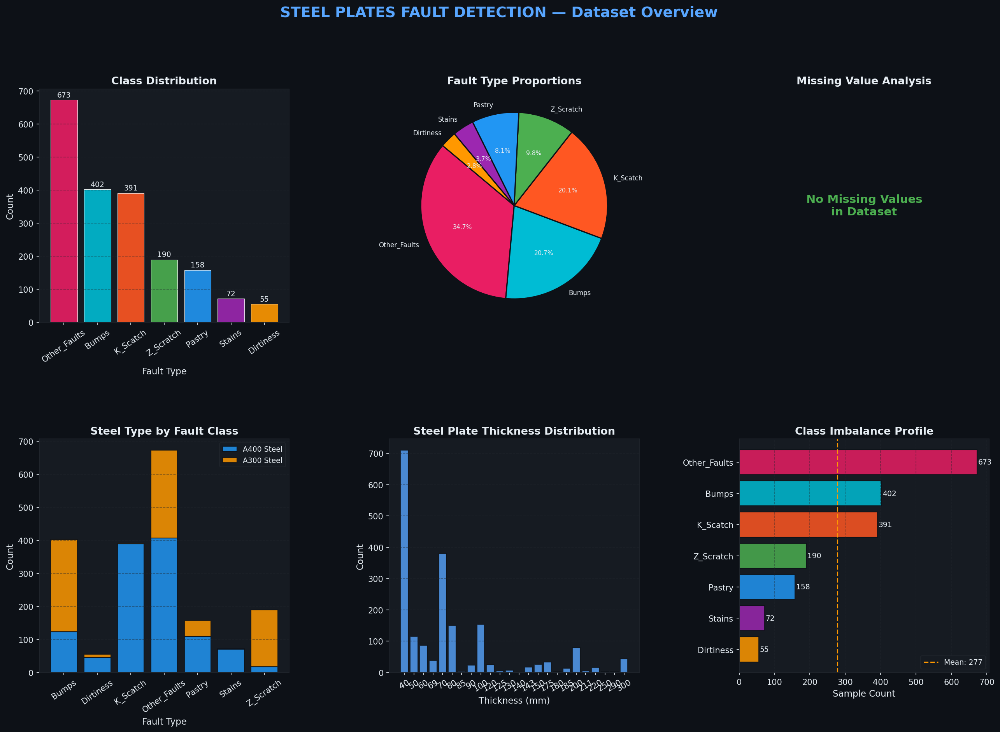
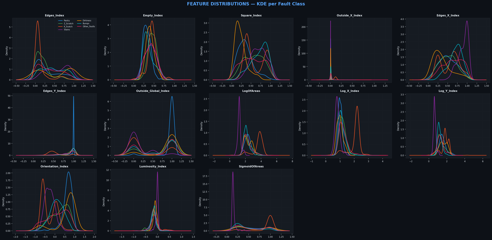
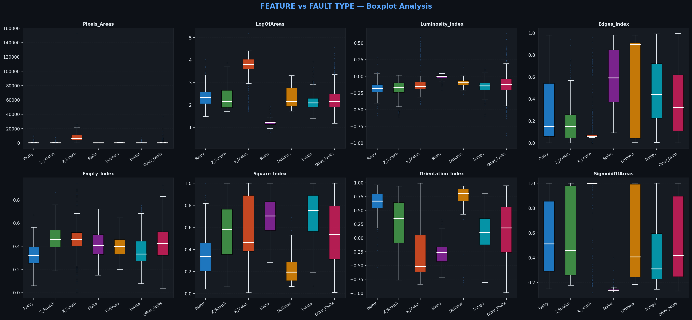
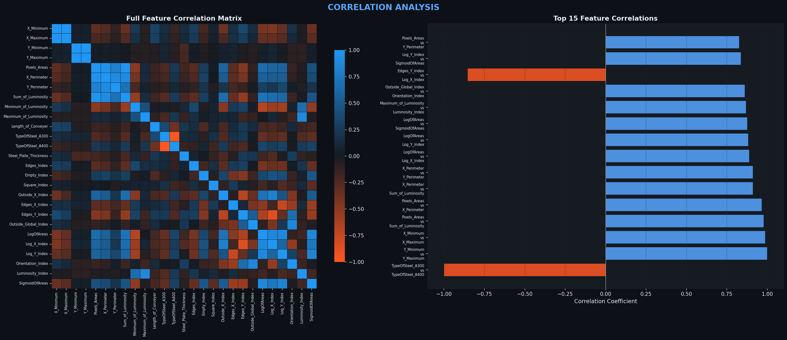
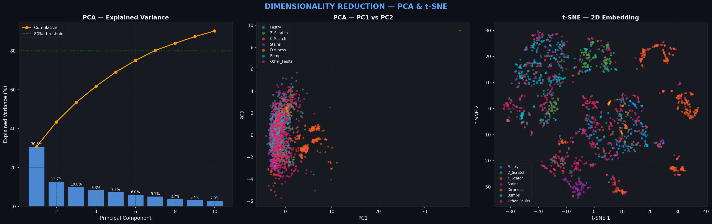
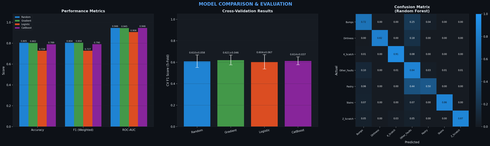
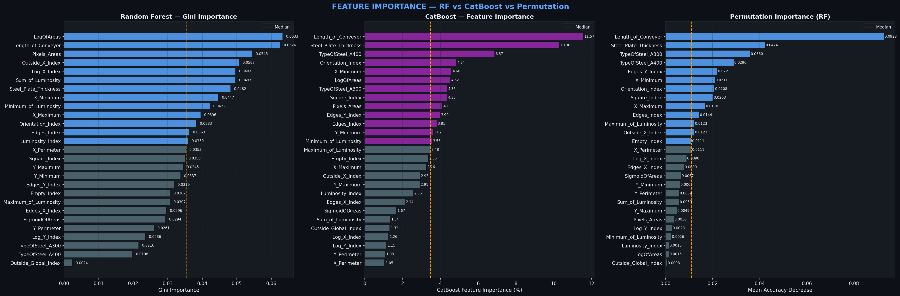
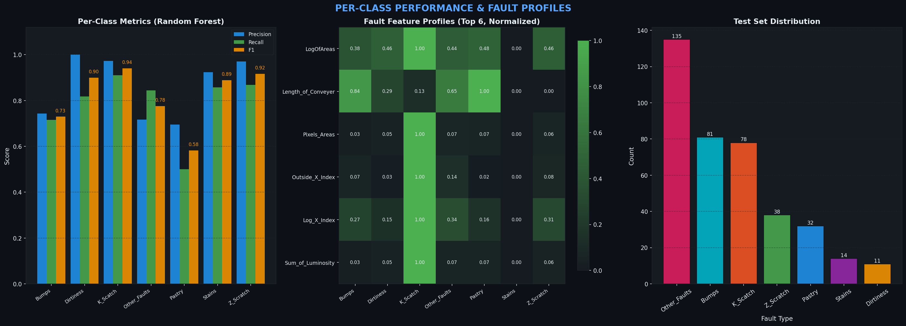
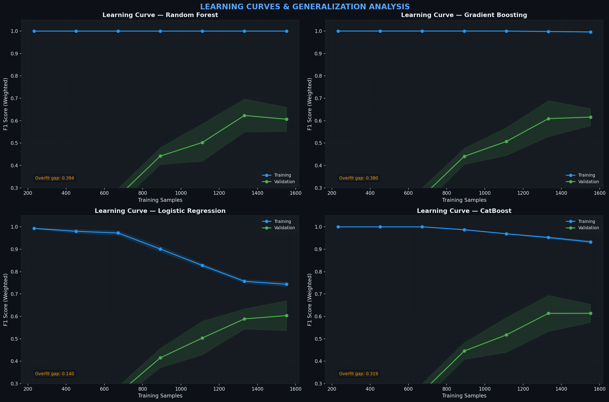

# Steel Plates Fault Detection

[](https://www.python.org/)
[](https://scikit-learn.org/)
[](https://catboost.ai/)
[](LICENSE)
[](https://archive.ics.uci.edu/dataset/198/steel+plates+faults)

Comprehensive exploratory data analysis and multi-class fault classification on the **UCI Steel Plates Faults** dataset. The project covers the full ML pipeline — from raw data profiling to model evaluation — benchmarking four classifiers, with a focus on interpretability and production-readiness.

---

## Problem Statement

In steel manufacturing, surface defects on rolled plates directly impact product quality and operational cost. Early and accurate fault detection enables timely intervention on the production line, reducing scrap rates and preventing downstream failures. This project builds a classifier that identifies **7 distinct fault types** from 27 geometric and luminosity measurements captured during production.

---

## Dataset

| Property | Value |
|---|---|
| Source | [UCI Machine Learning Repository](https://archive.ics.uci.edu/dataset/198/steel+plates+faults) |
| Samples | 1,941 |
| Features | 27 |
| Classes | 7 |
| Missing values | None |
| Label format | One-hot encoded (converted to single label) |

**Fault Classes:**

| Class | Samples | % of Total | Description |
|---|---|---|---|
| Other Faults | 673 | 34.7% | General surface irregularities |
| Bumps | 402 | 20.7% | Raised deformations on the surface |
| K_Scatch | 391 | 20.1% | Longitudinal scratch marks |
| Z_Scratch | 190 | 9.8% | Diagonal scratch marks |
| Pastry | 158 | 8.1% | Layered surface delamination |
| Stains | 72 | 3.7% | Discoloration / oxidation marks |
| Dirtiness | 55 | 2.8% | Contamination-related defects |

> **Class imbalance note:** Dirtiness (55) and Stains (72) are significantly underrepresented. F1-weighted is used as the primary metric to fairly account for this.

---

## Analysis Overview

### 1. Dataset Overview
Class distribution, fault proportions pie chart, steel type breakdown (A300 vs A400), plate thickness distribution, and imbalance profile.



### 2. Feature Distributions
Per-class KDE plots for 13 continuous features, revealing which features carry class-discriminative signal.



### 3. Boxplot Analysis
Inter-class spread and outlier patterns for 8 geometric and luminosity features across all 7 fault types.



### 4. Correlation Analysis
Full 27×27 feature correlation matrix and the top 15 most correlated feature pairs — identifying redundancy and multicollinearity.



### 5. Dimensionality Reduction
PCA explained variance decomposition and t-SNE 2D embedding, assessing cluster separability across fault types in the original 27-dimensional space.



### 6. Model Comparison
Side-by-side evaluation of **four classifiers** (Random Forest, Gradient Boosting, CatBoost, Logistic Regression) on Accuracy, F1-Weighted, and ROC-AUC, with 5-fold cross-validation results and a normalized confusion matrix for the best model.



### 7. Feature Importance
Three-panel comparison: **Random Forest Gini importance**, **CatBoost feature importance**, and **permutation importance**, cross-validating which features genuinely drive predictions across different algorithms.



### 8. Per-Class Metrics
Precision / Recall / F1 breakdown per fault class, a normalized feature profile heatmap showing how each fault manifests in the top features, and test set support distribution.



### 9. Learning Curves
Training vs. validation score curves for overfitting/underfitting diagnosis across **all four models** (2×2 grid), with overfit gap annotation per model.



---

## Model Results

| Model | Accuracy | F1 (Weighted) | ROC-AUC | CV F1 (5-Fold) |
|---|---|---|---|---|
| **Random Forest** | **80.5%** | **80.4%** | **94.6%** | 61.0% ± 5.8% |
| Gradient Boosting | 80.2% | 80.4% | 94.5% | 62.1% ± 4.6% |
| CatBoost | 78.9% | 79.0% | 94.6% | **61.4% ± 3.7%** |
| Logistic Regression | 72.8% | 72.7% | 90.6% | 60.4% ± 6.7% |

> **Best model:** Random Forest leads on test F1 (80.4%) and ROC-AUC (94.6%), while CatBoost achieves the **most stable cross-validation score** (61.4% ± 3.7%) — the lowest variance of all four models, suggesting better generalization under distribution shift. The gap between test F1 (~80%) and CV F1 (~61%) is consistent across tree-based models and reflects the class imbalance challenge with Dirtiness and Stains minority classes.

---

## Project Structure

```
steel-plates-fault-detection/
│
├── main.py                       
├── config.yaml                   
├── requirements.txt
│
├── src/
│   ├── __init__.py
│   ├── config.py               
│   ├── data.py                   
│   ├── models.py             
│   └── plots.py          
│
├── data/
│   └── steel_plates_faults.csv
│
└── plots/
    ├── 01_dataset_overview.png
    ├── 02_feature_distributions.png
    ├── 03_boxplots_per_class.png
    ├── 04_correlation_analysis.png
    ├── 05_dimensionality_reduction.png
    ├── 06_model_comparison.png
    ├── 07_feature_importance.png
    ├── 08_per_class_metrics.png
    └── 09_learning_curves.png
```

---

## Installation & Usage

```bash
# Clone the repository
gh repo clone emintiras/Steel-Plates-Fault-Detection
cd Steel-Plates-Fault-Detection

# Install dependencies
pip install -r requirements.txt

# Run the full pipeline (EDA + training + all plots)
python main.py

# EDA only — class distributions, KDE, boxplots, PCA/t-SNE
python main.py --mode eda

# Training only — skip slow dimensionality reduction plots
python main.py --mode train

# Skip t-SNE (faster iteration during development)
python main.py --no-tsne

# Use a custom config or output directory
python main.py --config my_config.yaml --output-dir results/
```

**All hyperparameters** (model settings, feature lists, plot DPI, colour palette) live in `config.yaml` — no need to touch any source file for tuning.

---

## Key Findings

- **LogOfAreas** and **SigmoidOfAreas** are the top two predictive features across both Random Forest and CatBoost — confirming that defect area is the primary discriminator regardless of algorithm
- **Edges_Index** and **Empty_Index** strongly separate scratch-type faults (Z_Scratch, K_Scatch) from surface defects (Stains, Dirtiness) — consistent with the elongated geometry of scratches
- The three-way feature importance comparison (RF Gini, CatBoost, Permutation) shows high agreement on the top features, adding confidence that the rankings reflect true signal rather than model-specific artefacts
- The t-SNE embedding reveals **well-separated clusters for Bumps and K_Scatch** but significant overlap between Stains, Dirtiness and Other_Faults — explaining the lower per-class recall for minority classes
- **TypeOfSteel_A300/A400** contributes very low importance across all methods, suggesting fault type is largely independent of steel grade in this dataset
- Random Forest achieves **ROC-AUC of 0.946** in a one-vs-rest setting; CatBoost matches this exactly (0.946) while delivering the **lowest CV variance (±3.7%)** — making it the most stable model for deployment